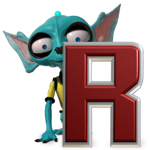

# Ricochet Universe



Explore, download and play Ricochet Infinity and Ricochet Lost Worlds level sets created by the community.

Visit the live website at [https://www.ricochetuniverse.com](https://www.ricochetuniverse.com)

## Server requirements

Use the provided `docker-compose.yml` to easily set up the server environment.

For bare-metal installs:

- [Caddy](https://caddyserver.com)
    - Use Caddy instead of PHP's development server to match production usage as there can be [subtle bugs/differences](https://gitlab.com/ngyikp/ricochet-levels/-/issues/3)
- [PHP 8.4](https://www.php.net)
- [Composer](https://getcomposer.org)
- [MariaDB 11.4](https://mariadb.org)
- [Node.js v20](https://nodejs.org)
- [Redis 6.2](https://redis.io)
- A [queue worker](https://laravel.com/docs/11.x/queues#supervisor-configuration)
- A [task scheduler](https://laravel.com/docs/11.x/scheduling#running-the-scheduler)

## Installation for development

After you `git clone` this repo...

1. Add this host to your `hosts` file:
    ```
    127.0.0.1 ricochet.test
    ```
2. Install Docker and Docker Compose
3. Copy `.env.example` to `.env` and adjust your configuration. Note that `DB_USERNAME` and `DB_PASSWORD` will be used as the initial MariaDB user when creating the database container
4. Create a text file on `docker/secrets/mariadb_root_password.txt` that will be your root MariaDB password
5. Install [mkcert](https://github.com/FiloSottile/mkcert), then run `mkcert -install` and `mkcert ricochet.test`, and move the 2 generated `.pem` files to `docker/secrets/`
6. Open a terminal window and execute these commands:
    ```bash
    docker-compose run --rm php composer install
    docker-compose run --rm node npm install
    docker-compose run --rm node npm run development
    docker-compose run --rm php php artisan migrate
    docker-compose run --rm php php artisan storage:link --relative
    ```

Optional:

- [Laravel IDE Helper](https://github.com/barryvdh/laravel-ide-helper) is installed, you can generate helper files by executing these commands:
    ```bash
    docker-compose run --rm php php artisan ide-helper:generate
    docker-compose run --rm php php artisan ide-helper:meta
    ```

## Day-to-day development

Execute `docker-compose up -d` to start the services, you can access the website at `https://ricochet.test:8000`

Execute `docker-compose run --rm node npm run watch` and leave the terminal window open to rebuild assets whenever you save.

See CONTRIBUTING.md for more tips and commands!

## Misc info

### web.archive.org

- https://web.archive.org/web/20171128131900/http://www.ricochetinfinity.com
- https://web.archive.org/web/20171128145057/http://www.ricochetinfinity.com:80/levels/index.php

## License

[Mozilla Public License, version 2.0](https://www.mozilla.org/en-US/MPL/2.0/)

Discord and GitLab icons are from the [Simple Icons](https://simpleicons.org) project and licensed under the [CC0 1.0 Universal](https://github.com/simple-icons/simple-icons/blob/develop/LICENSE.md) License.
